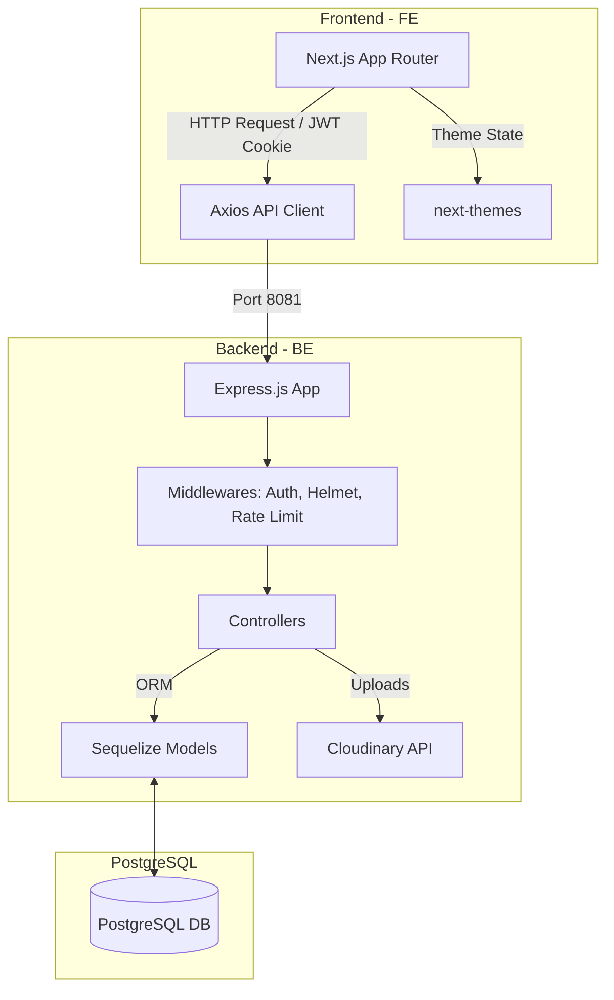

# IT Job Platform 🚀

A modern, full-stack recruitment portal specifically designed for the IT industry in Vietnam. This repository follows a monorepo structure consisting of a **Next.js frontend** and an **Express backend** powered by **PostgreSQL**.

---

## 📁 Repository Structure

```text
IT-JOB/
├── BE/          # Express Backend API (Node.js, Sequelize, PostgreSQL)
└── FE/          # Next.js Frontend Application (App Router, Tailwind CSS, TypeScript)
```

---

## 🏗️ Tech Stack

### Frontend (`FE/`)
* **Framework:** Next.js 15+ (App Router with Turbopack)
* **Language:** TypeScript
* **Styling:** Tailwind CSS v4 & Tailwind Merge
* **Animations:** Motion (Framer Motion)
* **UI Components:** Shadcn/ui (Radix UI primitives)
* **Form Management:** React Hook Form & Zod (validation)
* **Data Visualization:** Recharts
* **State Management:** React Context API

### Backend (`BE/`)
* **Framework:** Express.js (v5)
* **ORM:** Sequelize
* **Database:** PostgreSQL
* **Security:** Helmet, Express Rate Limit, CORS, Cookie Parser, Bcrypt.js, JsonWebToken
* **File Uploads:** Multer & Cloudinary
* **Validation:** Joi
* **Runtime / Live Reload:** Node.js (v22), Nodemon

---

## 🎨 Key Features

1. **Role-Based Portals:** Custom user flows and dashboards for:
   * **Candidates:** Profile creation, resume (CV) upload, job searching/filtering, application history.
   * **Employers (HR):** Company profile management, job posting, applicant tracking/reviewing.
   * **Admin:** System-wide management and control.
2. **Advanced Job Search:** Filter jobs by skill, level, salary range, job type, and location.
3. **Interactive Social Feed:** Features for social-like interactions including posting updates, liking, and connection requests between developers.
4. **Dark Mode:** Seamless theme transitions using `next-themes`.
5. **Security & Rate Limiting:** JWT-based cookie authentication, secure password hashing, and API rate limiting.

---

## 📊 System Architecture



---

## 🚀 Getting Started

### Prerequisites
Make sure you have the following installed on your machine:
* **Node.js** (v22 recommended)
* **PostgreSQL** instance
* **Cloudinary** account (for image/document uploads)

---

### 1. Backend Setup (`BE/`)

1. Navigate to the backend directory:
   ```bash
   cd BE
   ```

2. Install dependencies:
   ```bash
   npm install
   ```

3. Configure environment variables. Create a `.env` file in the `BE` folder with the following configuration:
   ```env
   # App configuration
   APP_NAME="IT Job API"
   PORT=8081
   NODE_ENV=development
   CLIENT_URL=http://localhost:3000

   # Database configuration
   DB_HOST=127.0.0.1
   DB_PORT=5432
   DB_NAME=it_job_db
   DB_USER=postgres
   DB_PASSWORD=your_postgres_password
   DB_SSL=false

   # JWT secrets
   JWT_ACCESS_SECRET=your_jwt_access_secret_key
   JWT_REFRESH_SECRET=your_jwt_refresh_secret_key
   JWT_ACCESS_EXPIRES_IN=15m
   JWT_REFRESH_EXPIRES_IN=7d

   # Cloudinary configuration
   CLOUDINARY_CLOUD_NAME=your_cloudinary_cloud_name
   CLOUDINARY_API_KEY=your_cloudinary_api_key
   CLOUDINARY_API_SECRET=your_cloudinary_api_secret
   CLOUDINARY_CLOUD_FOLDER=it_job_platform
   ```

4. Start the development server (runs Nodemon):
   ```bash
   npm run dev
   ```
   The backend server will run on `http://localhost:8081`.

---

### 2. Frontend Setup (`FE/`)

1. Navigate to the frontend directory:
   ```bash
   cd FE
   ```

2. Install dependencies:
   ```bash
   npm install
   ```

3. Configure environment variables. Create a `.env` file in the `FE` folder:
   ```env
   NEXT_PUBLIC_BE_ENDPOINT=http://localhost:8081/api
   ```

4. Start the development server:
   ```bash
   npm run dev
   ```
   Open [http://localhost:3000](http://localhost:3000) in your browser.

---

## 🐳 Docker Deployment (Backend)

The backend directory contains a `Dockerfile` for production packaging.

1. Build the Docker image:
   ```bash
   docker build -t it-job-be ./BE
   ```

2. Run the container:
   ```bash
   docker run -p 8081:8081 --env-file ./BE/.env it-job-be
   ```

---

## 📝 License

This project is proprietary and confidential. All rights reserved.
